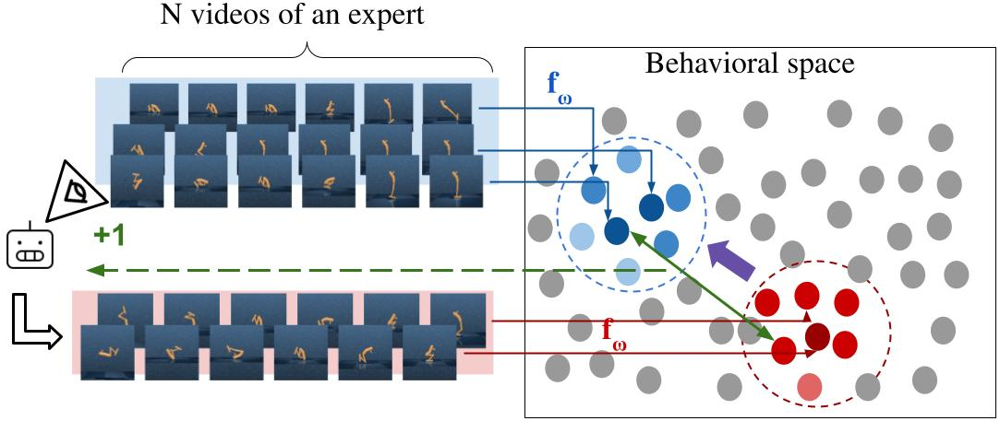
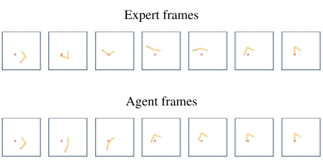
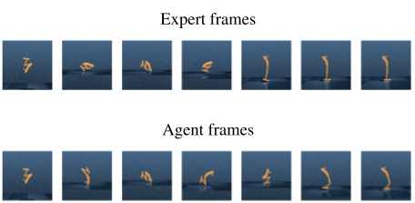
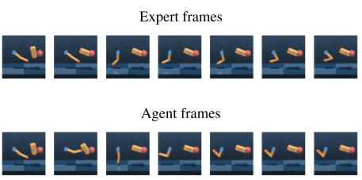
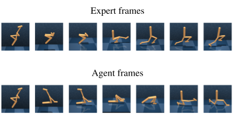

# ifobl
Imitation from observation algorithm to train agents to perform tasks using only a limited number of pixel-based expert observations and based on a behavioral learning principle.

<p align="center">

</p>
<p align="left">
An encoder that takes videos of agent trajectories and embeds them in a "behavioral space" is trained using contrastive learning (enforcing successful trajectories to lie close together). 
We use this to encode N expert videos in a region of the behavioral space in blue. The reward function corresponds to the distance of the agent's trajectory to the set of expert trajectories. 
As the agent progresses, its current trajectories are incorporated as "negative" examples into the contrastive learning in red.
</p>


<p align="center">




<br>
Some demonstrations
</p>

## Installation

```shell
conda env create -f env.yml
conda activate ifobl
```

## Training (example with reacher hard task)

* Train expert
```shell
python train.py task=reacher_hard exp_group=reacher_hard exp_id=1
```

Watch training on tensorboard
```shell
tensorboard --logdir exp_local
```

* Generate 5000 expert videos
```shell
python scripts/generate_dmc_video.py --env reacher_hard2 --episode_len 60
```
The number of expert videos to generate is hard-coded. Change it in `scripts/generate_dmc_video.py`.

* Pretrain image and video encoders
```shell
python train_cmc.py task=reacher_hard2 exp_id=1
```
Watch training on tensorboard
```shell
tensorboard --logdir cmc_exp_local
```

* Train agent
```shell
python train_rlv2.py task=reacher_hard2
```
Watch training on tensorboard
```shell
tensorboard --logdir rlv2_exp_local
```
Evaluation videos are generated in `rlv2_exp_local/reacher_hard/<exp_id>/train_video` directory.

## Additional information

* `cmc_model.py`: contains the models, neural networks and losses used to train the trajectory encoder
* `drqv2.py`: contains the implementations of the policy and q-value functions used to train the agents and experts
* `rl_model.py`: contains the implementations of the policy and q-value functions used to train the state-based agents
* `final_run`: contains the scripts to train the experts and agents for other tasks such as Walker run, Hopper stand and finger turn
* `dmc.py`: contains environment creation functions and environment wrappers
* `scripts/generate_dmc_video.py`: shows how to use trained agents in test time

## Acknowledgements
* We reuse Denis Yarats's [DrQv2 code](https://github.com/facebookresearch/drqv2) to train our RL agents
